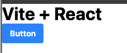
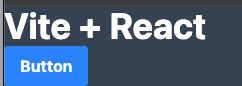

# Tailwind Dark Mode Implementation

A simple project to learn and implement dark mode in Tailwind CSS.

## Features
- Dark mode toggle using class-based approach

## Screenshots

## What I Learned
- How to implement dark mode in Tailwind
- Working with React useEffect for DOM manipulation